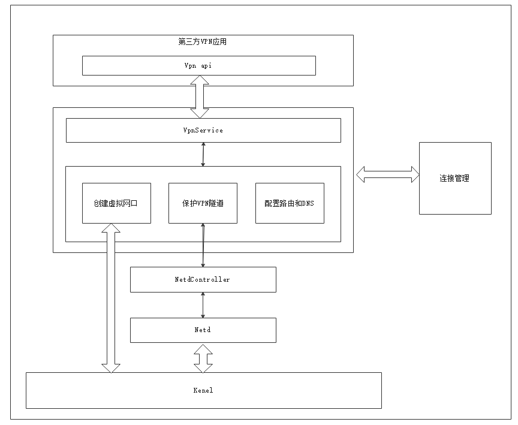
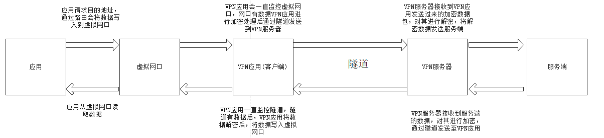

# Net Manager<a name="EN-US_TOPIC_0000001105058232"></a>

-    [简介](#section112mcpsimp)
-    [目录](#section125mcpsimp)
-    [约束](#section133mcpsimp)
-    [相关仓](#section155mcpsimp)


## 简介

第三方VPN应用介绍：

​   VPN（Virtual Private Network）是虚拟专用网络，VPN是两个或多个物理网络或设备之间沟通互联网/公共网络创建的虚拟网络，可以为企业之间或者个人与企业之间提供安全（加密）的数据传输隧道服务。VPN的功能主要是帮助不在公司内部局域网的人员可以通过数据加密的方式（VPN）访问公司内部资源。本服务为第三方VPN应用核心接口，第三方实现VPN网络通信。

**图 1**  第三方VPN应用架构图



**图 2**  第三方VPN应用流程图



## 目录

```
/foundation/communication/netmanager_ext/
├── figures                                  # 图片
├── frameworks                               # 框架代码
│   ├── native                               # 内部接口实现
│   │   └── externalvpnclient                # VPN客户
│   │       └── src                          # VPN客户实现
│   │          └── proxy                     # VPN客户代理器实现
├── interfaces                               # 接口代码
│   ├── innerkits                            # 内部接口
│   │   └── externalvpnclient                # VPN客户
│   │       └── include                      # VPN客户头文件
│   │          └── proxy                     # VPN客户代理器的头文件
│   └── kits                                 # 外部接口
│       └── js
├── services                                 # 核心服务代码目录
│   ├── externalvpnmanager                   # 外部VPN服务
│   │   ├── include                          # 头文件
│   │   │   ├── sub                          # IPC通信头文件
│   │   ├── src                              # 源文件目录
│   │   │   ├── sub                          # IPC通信源文件
├── test                                     # 单元测试
│   ├── externalvpnmanager                   # 外部VPN服务
│   │   ├── unittest                         # 头文件
│   │   │   ├── external_vpn_manager_test    # IPC通信头文件
└── utils                                    # 公共功能实现
|   └── log                                  # 日志实现
└── ohos.build                               # 编译文件
└── netmanager_ext_config.gni                # gn系统文件
```

## 约束

-    开发语言：C++
-    软件层，需要以下子系统和服务配合使用：蜂窝数据、安全子系统、软总线子系统、USB子系统、电源管理子系统等；
-    硬件层，需要搭载的设备支持以下硬件：可以进行独立蜂窝通信的Modem以及SIM卡；

## 相关仓

[netmanager_standard](https://gitee.com/openharmony/communication_netmanager_standard/blob/master/README.md)

[电话服务子系统](https://gitee.com/openharmony/docs/blob/master/zh-cn/readme/%E7%94%B5%E8%AF%9D%E6%9C%8D%E5%8A%A1%E5%AD%90%E7%B3%BB%E7%BB%9F.md)

[ telephony_cellular_data](https://gitee.com/openharmony/telephony_cellular_data/blob/master/README.md)

