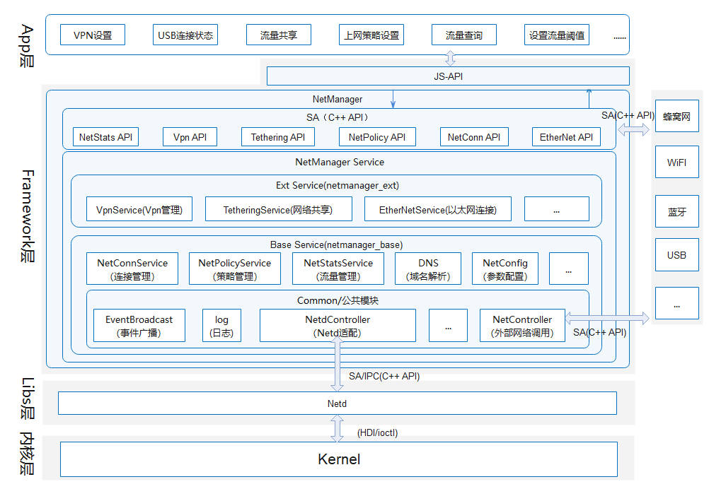

# Net Manager<a name="EN-US_TOPIC_0000001105058232"></a>

-    [简介](#简介)
-    [目录](#目录)
-    [约束](#约束)
-    [接口说明](#接口说明)
-    [使用说明](#使用说明)
-    [相关仓](#相关仓)


## 简介

网络管理介绍：

​    网络管理主要分为连接管理、策略管理、流量管理、网络共享、VPN管理以及以太网连接等模块，其中连接管理、策略管理、流量管理为基础服务，归档在netmanager_base仓，以太网连接、网络共享、VPN管理三个模块为可裁剪扩展模块，归档在netmanager_ext仓，netmanager_ext编译构建依赖netmanager_base库内容。如图1：网络管理架构图；

**图 1**  网络管理架构图



## 目录

```
foundation/communication/netmanager_ext/
├─figures                            #README用于的png图片
├─frameworks                         #
│  ├─js                              #js接口实现
│  │  └─napi                         
│  │      └─ethernet                 #以太网
│  │          ├─include              
│  │          └─src                  
│  └─native                          #C++接口实现
│      └─ethernetclient              #以太网
│         └─src                      #
│             └─proxy                #
          
├─interfaces                         #C++接口头文件
│  ├─innerkits                       
│  │  ├─ethernetclient               #以太网
│  │  │  └─include                   
│  │  │      └─proxy                 #SA IPC头文件
│  │  └─include                      
│  └─kits                            
│      └─js                          
├─sa_profile                         #SA服务配置文件
├─services                           #C++内部实现
│  └─ethernetmanager                 #以太网模块
│      ├─include                     
│      │  └─stub                     
│      └─src                         
│          └─stub                    
├─test                               #单元测试代码
│  └─ethernetmanager                 #以太网模块
│      └─unittest                    
│          └─ethernet_manager_test   
└─utils                              #公共功能
    └─log                            #日志实现
        ├─include                    
        └─src                        
```

## 约束

-    开发语言：C++
-    软件层，需要以下子系统和服务配合使用：蜂窝数据、WiFi系统、安全子系统、软总线子系统、USB子系统、电源管理子系统等；
-    硬件层，需要搭载的设备支持以下硬件：可以进行独立蜂窝通信的Modem以及SIM卡；

## 接口使用说明

## ethernet.setIfaceConfig<a name=ethernet.setIfaceConfig-callback></a>

setIfaceConfig\(iface: string, ic: InterfaceConfiguration, callback: AsyncCallback<void\>\): void

设置网络接口配置信息，使用callback方式作为异步方法。

需要ohos.permission.GET\_NETWORK\_INFO权限，该权限为系统权限。

- 参数

  | 参数名   | 类型                                              | 必填 | 说明                                       |
  | -------- | ------------------------------------------------- | ---- | ------------------------------------------ |
  | iface    | string                                            | 是   | 接口名                                     |
  | ic       | [InterfaceConfiguration](#InterfaceConfiguration) | 是   | 要设置的网络接口配置信息                   |
  | callback | AsyncCallback&lt;void&gt;                         | 是   | 回调函数。成功无返回，失败返回对应错误码。 |


- 示例

  ```js
  ethernet.setIfaceConfig("eth0", {mode:ethernet.STATIC,ipAddr:"192.168.1.123", routeAddr:"192.168.1.1",
      gateAddr:"192.168.1.1", maskAddr:"255.255.255.0", dnsAddr0:"1.1.1.1", dnsAddr1:"2.2.2.2"},
      (error) => {
          if (error) {
              console.log("setIfaceConfig callback error = " + error);
          } else {
              console.log("setIfaceConfig callback ok ");
          }
      });
  ```


## ethernet.setIfaceConfig<a name=ethernet.setIfaceConfig-promise></a>

setIfaceConfig\(iface: string, ic: InterfaceConfiguration\): Promise<void\>

设置网络接口配置信息，使用Promise方式作为异步方法。

需要ohos.permission.GET\_NETWORK\_INFO权限，该权限为系统权限。

- 参数

  | 参数名 | 类型                                              | 必填 | 说明                     |
  | ------ | ------------------------------------------------- | ---- | ------------------------ |
  | iface  | string                                            | 是   | 接口名                   |
  | ic     | [InterfaceConfiguration](#InterfaceConfiguration) | 是   | 要设置的网络接口配置信息 |

- 返回值

  | 类型                | 说明                                                        |
  | ------------------- | ----------------------------------------------------------- |
  | Promise&lt;void&gt; | 以Promise形式返回执行结果。成功无返回，失败返回对应错误码。 |

- 示例

  ```js
  ethernet.setIfaceConfig("eth0", {mode:ethernet.STATIC,ipAddr:"192.168.1.123", routeAddr:"192.168.1.1",
      gateAddr:"192.168.1.1", maskAddr:"255.255.255.0", dnsAddr0:"1.1.1.1", dnsAddr1:"2.2.2.2"}).then(() => {
      console.log("setIfaceConfig promiss ok ");
  }).catch((error) => {
      console.log("setIfaceConfig promiss error = " + error);
  });
  ```

## ethernet.getIfaceConfig<a name=ethernet.getIfaceConfig-callback></a>

getIfaceConfig\(iface: string, callback: AsyncCallback<InterfaceConfiguration\>\): void

获取网络接口配置信息，使用callback方式作为异步方法。

需要ohos.permission.GET\_NETWORK\_INFO权限，该权限为系统权限。

- 参数

  | 参数名   | 类型                                                         | 必填 | 说明                                                         |
  | -------- | ------------------------------------------------------------ | ---- | ------------------------------------------------------------ |
  | iface    | string                                                       | 是   | 接口名                                                       |
  | callback | AsyncCallback&lt;[InterfaceConfiguration](#InterfaceConfiguration)&gt; | 是   | 回调函数。成功返回[InterfaceConfiguration](#InterfaceConfiguration)，失败返回对应错误码。 |


- 示例

  ```js
  ethernet.getIfaceConfig("eth0", (error, value) => {
      if (error) {
          console.log("getIfaceConfig  callback error = " + error);
      } else {
          console.log("getIfaceConfig callback mode = " + value.mode);
          console.log("getIfaceConfig callback ipAddr = " + value.ipAddr);
          console.log("getIfaceConfig callback routeAddr = " + value.routeAddr);
          console.log("getIfaceConfig callback gateAddr = " + value.gateAddr);
          console.log("getIfaceConfig callback maskAddr = " + value.maskAddr);
          console.log("getIfaceConfig callback dns0Addr = " + value.dns0Addr);
          console.log("getIfaceConfig callback dns1Addr = " + value.dns1Addr);
      }
  });
  ```


## ethernet.getIfaceConfig<a name=ethernet.getIfaceConfig-promise></a>

getIfaceConfig\(iface: string\): Promise<InterfaceConfiguration\>

获取网络接口配置信息，使用Promise方式作为异步方法。

需要ohos.permission.GET\_NETWORK\_INFO权限，该权限为系统权限。

- 参数

  | 参数名 | 类型   | 必填 | 说明   |
  | ------ | ------ | ---- | ------ |
  | iface  | string | 是   | 接口名 |

- 返回值

  | 类型                                                         | 说明                                                         |
  | ------------------------------------------------------------ | ------------------------------------------------------------ |
  | Promise&lt;[InterfaceConfiguration](#InterfaceConfiguration)&gt; | 以Promise形式返回执行结果。成功返回[InterfaceConfiguration](#InterfaceConfiguration)，失败返回对应错误码。 |

- 示例

  ```js
  ethernet.getIfaceConfig("eth0").then((data) => {
      console.log("getIfaceConfig promiss mode = " + data.mode);
      console.log("getIfaceConfig promiss ipAddr = " + data.ipAddr);
      console.log("getIfaceConfig promiss routeAddr = " + data.routeAddr);
      console.log("getIfaceConfig promiss gateAddr = " + data.gateAddr);
      console.log("getIfaceConfig promiss maskAddr = " + data.maskAddr);
      console.log("getIfaceConfig promiss dns0Addr = " + data.dns0Addr);
      console.log("getIfaceConfig promiss dns1Addr = " + data.dns1Addr);
  }).catch((error) => {
      console.log("getIfaceConfig promiss error = " + error);
  });
  ```

## ethernet.isIfaceActive<a name=ethernet.isIfaceActive-callback></a>

isIfaceActive\(iface: string, callback: AsyncCallback<number\>\): void

判断接口是否已激活，使用callback方式作为异步方法。

需要ohos.permission.GET\_NETWORK\_INFO权限，该权限为系统权限。

- 参数

  | 参数名   | 类型                        | 必填 | 说明                                               |
  | -------- | --------------------------- | ---- | -------------------------------------------------- |
  | iface    | string                      | 是   | 接口名                                             |
  | callback | AsyncCallback&lt;number&gt; | 是   | 回调函数。已激活:1,未激活:0,其他为获取失败错误码。 |


- 示例

  ```js
  ethernet.isIfaceActive("eth0", (error, value) => {
  	if (error) {
  		console.log("whether2Activate callback error = " + error);
  	} else {
  		console.log("whether2Activate callback = " + value);
  	}
  });
  ```


## ethernet.isIfaceActive<a name=ethernet.isIfaceActive-promise></a>

isIfaceActive\(iface: string\): Promise<number\>

判断接口是否已激活，使用Promise方式作为异步方法。

需要ohos.permission.GET\_NETWORK\_INFO权限，该权限为系统权限。

- 参数

  | 参数名 | 类型   | 必填 | 说明   |
  | ------ | ------ | ---- | ------ |
  | iface  | string | 是   | 接口名 |

- 返回值

  | 类型                  | 说明                                                         |
  | --------------------- | ------------------------------------------------------------ |
  | Promise&lt;number&gt; | 以Promise形式返回获取结果。已激活:1,未激活:0,其他为获取失败错误码。 |

- 示例

  ```js
  ethernet.isIfaceActive("eth0").then((data) => {
  	console.log("isIfaceActive promiss = " + data);
  }).catch((error) => {
  	console.log("isIfaceActive promiss error = " + error);
  });
  ```

## ethernet.getAllActiveIfaces<a name=ethernet.getAllActiveIfaces-callback></a>

getAllActiveIfaces\(callback: AsyncCallback<Array\<string\>\>\): void

获取活动的网络接口，使用callback方式作为异步方法。

需要ohos.permission.GET\_NETWORK\_INFO权限，该权限为系统权限。

- 参数

  | 参数名   | 类型                                 | 必填 | 说明                           |
  | -------- | ------------------------------------ | ---- | ------------------------------ |
  | callback | AsyncCallback&lt;Array\<string\>&gt; | 是   | 回调函数。返回值为对应接口名。 |


- 示例

  ```js
  ethernet.getAllActiveIfaces((error, value) => {
  	if (error) {
  		console.log("getAllActiveIfaces callback error = " + error);
  	} else {
          console.log("getAllActiveIfaces callback value.length = " + value.length);
  		for (let i = 0; i < value.length; i++) {
  			console.log("getAllActiveIfaces callback = " + value[i]);
  		}
  	}
  });
  ```

## ethernet.getAllActiveIfaces<a name=ethernet.getAllActiveIfaces-promise></a>

getAllActiveIfaces\(\): Promise<Array\<string\>\>

获取活动的网络接口，使用Promise方式作为异步方法。

需要ohos.permission.GET\_NETWORK\_INFO权限，该权限为系统权限。

- 返回值

  | 类型                           | 说明                                            |
  | ------------------------------ | ----------------------------------------------- |
  | Promise&lt;Array\<string\>&gt; | 以Promise形式返回获取结果。返回值为对应接口名。 |

- 示例

  ```js
  ethernet.getAllActiveIfaces().then((data) => {
      console.log("getAllActiveIfaces promiss data.length = " + data.length);
  	for (let i = 0; i < data.length; i++) {
  		console.log("getAllActiveIfaces promiss  = " + data[i]);
  	}
  }).catch((error) => {
  	console.log("getAllActiveIfaces promiss error = " + error);
  });
  ```

## 相关仓

[网络管理子系统](https://gitee.com/openharmony/docs/blob/master/zh-cn/readme/%E7%BD%91%E7%BB%9C%E7%AE%A1%E7%90%86%E5%AD%90%E7%B3%BB%E7%BB%9F.md)

**communication_netmanager_ext**

[communication_netmanager_ext](https://gitee.com/openharmony/communication_netmanager_ext)

[communication_netstack](https://gitee.com/openharmony/communication_netstack)